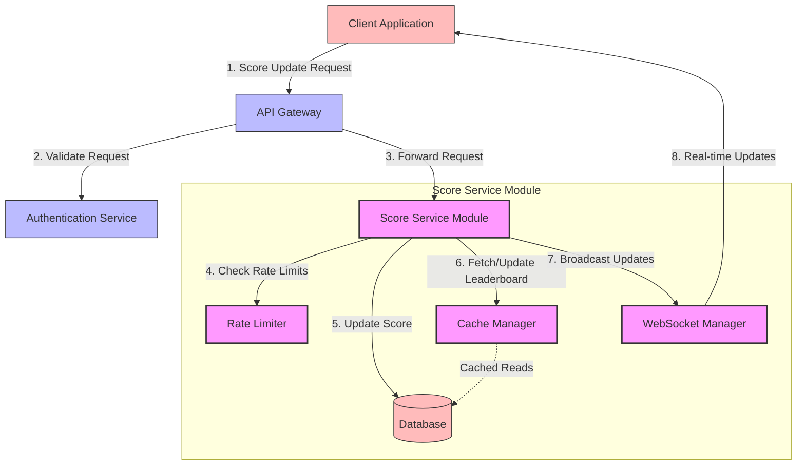

# Component Diagram

```mermaid
graph TB
    Client[Client Application]
    APIGateway[API Gateway]
    AuthService[Authentication Service]
    ScoreService[Score Service Module]
    WebSocketManager[WebSocket Manager]
    RateLimiter[Rate Limiter]
    CacheManager[Cache Manager]
    DB[(Database)]
    
    Client -->|1. Score Update Request| APIGateway
    APIGateway -->|2. Validate Request| AuthService
    APIGateway -->|3. Forward Request| ScoreService
    
    subgraph "Score Service Module"
        ScoreService -->|4. Check Rate Limits| RateLimiter
        ScoreService -->|5. Update Score| DB
        ScoreService -->|6. Fetch/Update Leaderboard| CacheManager
        ScoreService -->|7. Broadcast Updates| WebSocketManager
    end
    
    WebSocketManager -->|8. Real-time Updates| Client
    CacheManager -.->|Cached Reads| DB
    
    classDef primary fill:#f9f,stroke:#333,stroke-width:2px
    classDef secondary fill:#bbf,stroke:#333,stroke-width:1px
    classDef external fill:#fbb,stroke:#333,stroke-width:1px
    
    class ScoreService,WebSocketManager,RateLimiter,CacheManager primary
    class APIGateway,AuthService secondary
    class Client,DB external
```