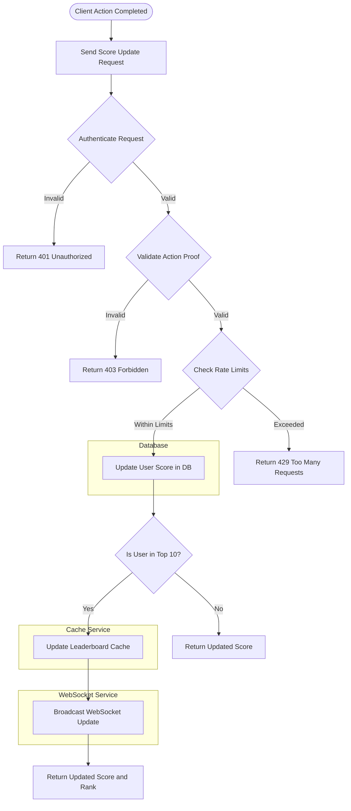

```mermaid
flowchart TB
    Start([Client Action Completed]) --> A[Send Score Update Request]
    A --> B{Authenticate Request}
    B -->|Invalid| C[Return 401 Unauthorized]
    B -->|Valid| D{Validate Action Proof}
    D -->|Invalid| E[Return 403 Forbidden]
    D -->|Valid| F{Check Rate Limits}
    F -->|Exceeded| G[Return 429 Too Many Requests]
    F -->|Within Limits| H[Update User Score in DB]
    H --> I{Is User in Top 10?}
    I -->|No| J[Return Updated Score]
    I -->|Yes| K[Update Leaderboard Cache]
    K --> L[Broadcast WebSocket Update]
    L --> M[Return Updated Score and Rank]
    
    subgraph WebSocket Service
        L
    end
    
    subgraph Cache Service
        K
    end
    
    subgraph Database
        H
    end
```