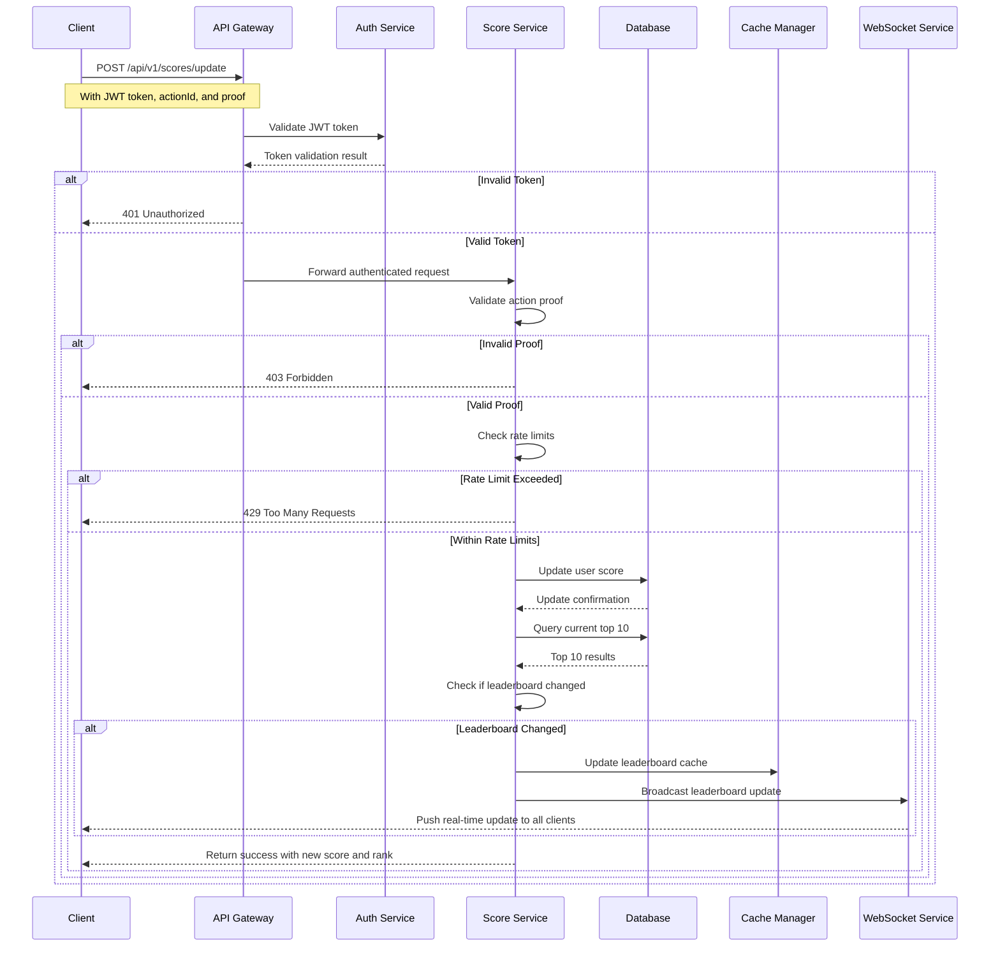

# Sequence Diagram

```mermaid
sequenceDiagram
    participant Client
    participant API as API Gateway
    participant Auth as Auth Service
    participant Score as Score Service
    participant DB as Database
    participant Cache as Cache Manager
    participant WS as WebSocket Service
    
    Client->>API: POST /api/v1/scores/update
    Note over Client,API: With JWT token, actionId, and proof
    
    API->>Auth: Validate JWT token
    Auth-->>API: Token validation result
    
    alt Invalid Token
        API-->>Client: 401 Unauthorized
    else Valid Token
        API->>Score: Forward authenticated request
        
        Score->>Score: Validate action proof
        alt Invalid Proof
            Score-->>Client: 403 Forbidden
        else Valid Proof
            Score->>Score: Check rate limits
            alt Rate Limit Exceeded
                Score-->>Client: 429 Too Many Requests
            else Within Rate Limits
                Score->>DB: Update user score
                DB-->>Score: Update confirmation
                
                Score->>DB: Query current top 10
                DB-->>Score: Top 10 results
                
                Score->>Score: Check if leaderboard changed
                
                alt Leaderboard Changed
                    Score->>Cache: Update leaderboard cache
                    Score->>WS: Broadcast leaderboard update
                    WS-->>Client: Push real-time update to all clients
                end
                
                Score-->>Client: Return success with new score and rank
            end
        end
    end
```